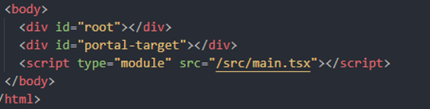

# 2024 이노베이션 캠프 | React 주특기 과제 Level 3

> Goal : 모달, 버튼을 포함한 웹페이지 연습하기

- 예시 사이트 : https://hh99-react-lv3.vercel.app/

## ✅ features : 구현해야 할 기능이에요.

<details>
<summary>Modal</summary>

- 모달 2개를 구현합니다.
  - `취소`, `확인`이 있고, overlay를 클릭했을 때 모달이 닫히지 않는 형태
  - `닫기` 버튼만 있고, overlay를 클릭했을 때 모달이 닫히는 형태
  - 모달을 `on` 시키는 버튼의 형태는 각각 달라야 합니다. (위에서 만든 버튼을 재사용하는 것도 좋아요.)
  </details>

<details>
<summary>Button</summary>

- 총 6개 형태의 버튼을 구현합니다. (예시 페이지에서 확인)
  - `styled-components` 를 이용하여 구현하며, props를 적절하게 잘 활용하여 구현하세요.
  - 버튼 label에 선택적으로 아이콘을 넣을 수 있도록 구현하세요.
  </details>

<details>
<summary>Input</summary>

- 총 2개의 input을 구현합니다.
  - 일반형식의 input
  - 숫자를 넣었을 때, 3자리 수마다 `콤마 ,`가 찍히는 input
  - form을 구현하고 각 input에 값을 입력하고 `저장` 버튼을 눌렀을 때 `{name: '아무 텍스트', price: "콤마가 없는 금액"}` 을 `alert`에 표시해보세요.
  </details>

<details>
<summary>Select</summary>

- select를 구현합니다.
  - select를 클릭했을 때, option 들이 나오고 해당 option을 클릭하면 select의 값이 변경됩니다.
  - select를 클릭했을 때 부모 요소에 의해서 가려지지 않도록 구현합니다. 부모 요소에 `overflow: hidden`을 적용하면 자식 컴포넌트가 부모 컴포넌트를 넘어갔을 때 가려지게 됩니다. 부모 컴포넌트에 `hidden` 속성이 있다고 하더라도 select는 가려지지 않아야 합니다.
  </details>

## ❓ Why: 과제 제출시에는 아래 질문의 답변과 함께 제출해주세요.

<details>
<summary>
1. 모달을 구현할 때 `react-portal`을 사용 하셨나요? `react-portal`이 무엇이고 어떻게 작동하는지 설명해 주세요.
</summary>
    
> 📌 **React 포탈**이란 공식문서에 따르면 부모 컴포넌트의 DOM 계층 구조 `바깥에 있는 DOM 노드`의 자식으로 렌더링하는 방법입니다.  
  react 는 `<div id=”root”></div>` 안에서 렌더링 되기에, root가 아닌 다른 DOM하위에는 렌더링될 수 없습니다.
  하지만, `React-portal`을 사용한다면 특정 DOM에 직접 접근하여, 해당 DOM의 하위에 렌더링이 가능합니다.
    
    
예시를 들면 : 
    
## 1. **React portal 리액트 포탈이 생성될 위치 생성**


## 2. **portal 될 element 설정**

.png>)

## 3. **portal 렌더링**

.png>)

</details>

<details>
<summary>
2. 다양한 형태의 버튼을 만들 때, 공통된 스타일 요소와 각각의 특별한 스타일 요소를 어떤 방법으로 styled-component에 적용하셨나요?
</summary>

> 📌 공통된 스타일 요소는 styled된 컴포넌트에 바로 적용을 하였고,
> 각각의 특별한 요소는 `props`를 전달받아 `분기`에 따른 스타일링을 적용했습니다.

### 공통 스타일 요소

```typescript
export const Button = styled.button<StyleProps>`
  border-radius: 8px;
  font-weight: 600;

  cursor: pointer;
  border-style: solid;
  
  ...
`;
```

### Props에 따른 특별한 스타일 요소

```typescript
type StyleProps = {
  $size?: "large" | "medium" | "small";
  $color?: "primary" | "negative";
  $outline?: boolean;
};

export const Button = styled.button<StyleProps>`
  ...

  ${({ $size = "medium" }) => sizeStyles[$size]};
  ${({ $color = "primary" }) =>
    $color === "primary" ? primaryStyles : negativeStyles};

  ${({ $outline: outline }) => outline && outlineStyles};
`;
```

  <details>
  <summary>전체 소스코드</summary>

```typescript
// src/styles/button.style.ts

import styled, { css } from "styled-components";

type StyleProps = {
  $size?: "large" | "medium" | "small";
  $color?: "primary" | "negative";
  $outline?: boolean;
};

export const Button = styled.button<StyleProps>`
  border-radius: 8px;
  font-weight: 600;

  cursor: pointer;
  border-style: solid;

  ${({ $size = "medium" }) => sizeStyles[$size]};
  ${({ $color = "primary" }) =>
    $color === "primary" ? primaryStyles : negativeStyles};

  ${({ $outline: outline }) => outline && outlineStyles};
`;

export const InnerDiv = styled.div`
  display: flex;
  align-items: center;
  justify-content: center;
  gap: 7px;
`;

const largeStyles = css`
  width: 200px;
  height: 50px;
`;

const mediumStyles = css`
  width: 130px;
  height: 45px;
`;

const smallStyles = css`
  width: 100px;
  height: 40px;
`;

const sizeStyles = {
  large: largeStyles,
  medium: mediumStyles,
  small: smallStyles,
};

const negativeStyles = css`
  color: rgb(214, 48, 49);
  background-color: rgb(250, 177, 160);
  border-color: rgb(250, 177, 160);
`;

const primaryStyles = css`
  background-color: rgb(85, 239, 196);
  border-color: rgb(85, 239, 196);
`;

const outlineStyles = css`
  background-color: white;
  border-width: 3px;
`;
```

  </details>

</details>

<details>
<summary>
3. 숫자 입력 필드에서 사용자가 입력한 콤마가 포함된 금액과 콤마가 제거된 실제 금액 값을 각각 어떻게 관리하셨나요? 이를 위해 여러 상태를 사용하셨나요, 아니면 단일 상태를 통해 처리하셨나요?
</summary>

> 📌 `price`라는 `단일 state`, `number`타입으로 관리했으며,
> input에 값을 할당하거나 변경된 값을 불러올 때마다 `string ↔ number` 변환했습니다.

```typescript
const [price, setPrice] = useState<number>(0);

const onChangePrice = (e: React.ChangeEvent<HTMLInputElement>) => {
  const value = e.target.value;
  setPrice(transStrToNumber(value));
};

<S.input.Input
  type="text"
  value={price?.toLocaleString()}
  onChange={onChangePrice}
/>;

// util.ts
export const transStrToNumber = (str: string): number => {
  // 0-9 숫자가 아닌 문자열은 ""으로 치환
  return Number(str.replace(/[^0-9]/g, ""));
};
```

</details>

<details>
<summary>
4. `overflow: hidden`이 적용된 부모 요소에도 영향을 받지 않고 옵션이 제대로 표시되게 하는 방법은 무엇인가요?
</summary>

> 📌 overflow: hidden이 적용된 요소보다 부모인 요소에 `React-Portal`을 적용하여 렌더링했습니다.

.png>)

</details>

## 👍 KPT 회고

### Keep

<details>
<summary>1. styled-components :: S-DOT 네이밍</summary>

- .png>)
- .png>)

### 1. styled-components와 관련된 것들은 styles/ 폴더 하위에 따로 관리했습니다.

```tsx
📦src
 ┣ 📂assets
 ┣ 📂components
 ┃ ┣ 📂atom
 ┃ ┣ 📂molecules
 ┃ ┗ 📂template
 ┣ 📂styles
 ┃ ┣ 📜button.style.ts
 ┃ ┣ 📜index.style.ts
 ┃ ┣ 📜input.style.ts
 ┃ ┣ 📜row.style.ts
 ┃ ┗ 📜select.style.ts
 ┣ 📂util
```

### 2. styles/index.style.ts 파일을 통해 styles/ 내부의 module export를 관리했습니다.

- index.style.ts를 통해서만 import하는 규칙

  .png>)

### 3. 각각의 스타일을 담은 파일 생성

.png>)

### 4. `S-DOT` 규칙으로 각 컴포넌트에서 import

- .png>)
- .png>)

</details>

<details>
<summary>2. styled-components :: props $prefix</summary>

> 💥 styled-components의 props를 전달하면, DOM 태그의 속성값에도 전달이 되는 문제가 있다.

```jsx
const StyledInput = styled.input`
  border : ${props => props.error ? '1px solid red' : '1px solid green'};
`

<StyledInput error={true} />
```

### 💥 위와 같이 `error` 라는 props을 전달하게 되면, `html attr` `props` 모두 전달이 된다.

.png>)

- #### error= `string` 이면, 가벼운 무시정도의 `경고` 메시지가 표시된다.

  .png>)

- #### error= `boolean` 이면, 신경이 쓰이는 `경고` 메시지가 표시된다.
  .png>)

### ✅ 5.1 버전부터 제공하는 transient props

`$` prefix를 붙여주게 되면, 더이상 html attr로 전달이 되지 않는다. 👍

**또한, `html 기본 attr`과 `내가 정의한 props의 속성`을 구별하기가 쉬운 장점이 있다.**

참고글 : https://velog.io/@cmk0905/Styled-Component-prefix

</details>

### Problem

<details>
<summary>1. Atomic 구조에서의 props drilling</summary>

> 💥 Page -> Templates -> Organisms -> Molecules -> Atoms의 구조일 때, Page에서 Atom까지 Props를 전달해야 할 상황이 있다면, `props drilling`이 발생한다.

- 방법 1.
  - Atoms + Molecules 까지만 `컴포넌트의 재사용성`을 위해 고민하고, Organisms부터 `Data Fetching`과 같은 비즈니스 로직을 담는다 (재사용성 낮음)
  - `Templates`는 `컴포넌트의 재사용`을 위해서가 아닌, Layout을 잡는 용도로 사용한다.
- 방법 2. `Pages`, `Templates`를 사용하지 않는다.
- 방법 3. Atomic구조를 생각하지 않고, `feature` 폴더로 이어간다.
- [관련사이트](https://heo-it-til.tistory.com/entry/SaraMara-%EC%95%84%ED%86%A0%EB%AF%B9-%EB%94%94%EC%9E%90%EC%9D%B8-%ED%8C%A8%ED%84%B4-%EB%8F%84%EC%9E%85%ED%95%98%EA%B8%B0)

</details>
